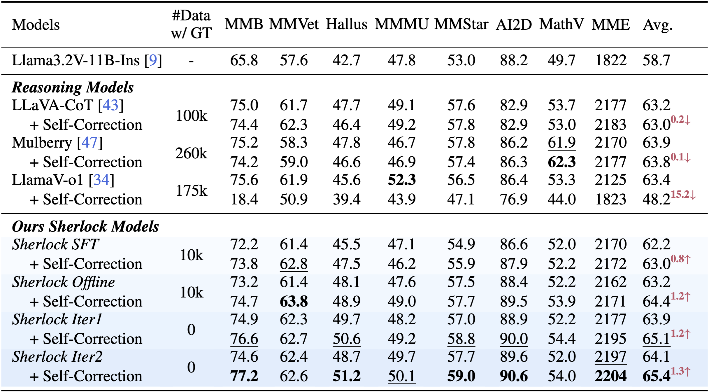

<div align=center>

</div>

<h2 align="center"> <a href="https://arxiv.org/abs/">Sherlock: Self-Correcting Reasoning in Vision-Language Models</a></h2>

<h5 align="center"> If you find our project is helpful, please consider to give us a star ⭐ on GitHub!</h5>

<h5 align="center">

[](https://arxiv.org/) [](https://dripnowhy.github.io/Sherlock/) [](https://huggingface.co/collections/Tuwhy/sherlock-6835f46e450a48f228f7e80d) [](https://github.com/DripNowhy/Sherlock)
<!-- [](https://huggingface.co/collections/Tuwhy/sherlock-6835f46e450a48f228f7e80d)  -->


</h5>

## 📣 News

<!-- - **[2025/5/29]** We've released our paper: [https://arxiv.org/abs/2411.10440](https://arxiv.org/abs/2411.10440) -->
- **[2025/5/28]** We release the training, evaluation, and data construction code of Sherlock.
- **[2025/5/27]** We've released the [model weights of Sherlock](https://huggingface.co/collections/Tuwhy/sherlock-6835f46e450a48f228f7e80d).

## 🔥 Highlights

<div align="center">
    
</div>

Our analysis reveals that existing reasoning VLMs, whether **trained with SFT or RL**, struggle to self-correct (both step-wise and response-wise).

<div align="center">
    
</div>

We propose Sherlock, the first framework to achieve intrinsic self-correction in reasoning VLMs, with significant improvements across diverse benchmarks using only **20k randomly sampled** annotation data from [LLaVA-CoT](https://github.com/PKU-YuanGroup/LLaVA-CoT).

<div align="center">
    
</div>

## 🔧 Usage

### Preparation

-  **Base Model**

    Our Sherlock is built on Llama3.2-Vision-11B-Instruct model, you can download it [here](https://huggingface.co/meta-llama/Llama-3.2-11B-Vision-Instruct).

- **Training Data**

    In SFT and Offline stage, Sherlock randomly sampled 20k data with annotation from LLaVA-CoT in total. During the Online self-improvement stage, we randomly sampled only question and image without ground truth from LLaVA-CoT until it self-construct 5k preference data. You should first download [LLaVA-CoT dataset](https://huggingface.co/datasets/Xkev/LLaVA-CoT-100k).

- **Sherlock Weights**

    You can download our Sherlock model weights from the Huggingface collection [Sherlock](https://huggingface.co/collections/Tuwhy/sherlock-6835f46e450a48f228f7e80d).

- **Demo**

    After download our Sherlock Iter2 weight, you can try the demo in this [file](https://github.com/DripNowhy/Sherlock/blob/main/inference/demo/inference.py).

### Training
Thanks to [LLaMA-Factory](https://github.com/hiyouga/LLaMA-Factory) team, our training code is modified based on their framework!
You can find detailed training guidance in this [file](https://github.com/DripNowhy/Sherlock/blob/main/train/README.md).

### Evaluation
Thanks to [VLMEvalKit](https://github.com/open-compass/VLMEvalKit) team, our training code is modified based on their framework!
You can find detailed evaluation guidance in this [file](https://github.com/DripNowhy/Sherlock/blob/main/inference/README.md).

## 🎉 Acknowledgement
Our project benefits from [LLaVA-CoT](https://github.com/PKU-YuanGroup/LLaVA-CoT), [LLaMA-Factory](https://github.com/hiyouga/LLaMA-Factory), and [VLMEvalKit](https://github.com/open-compass/VLMEvalKit). Thanks for their wonderful works.

## 📃 Citation
If you find our project is helpful, please cite our paper as
```
To be continued
```